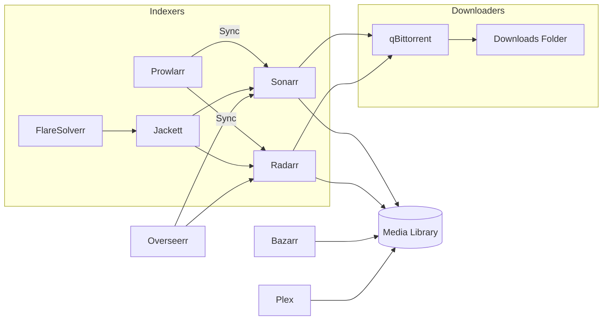

# ARR Stack — Complete Docker Compose Media Automation Setup

<p align="center">
  <a href="https://github.com/clickbang101/arr-stack">
    
  </a>
  <a href="https://github.com/clickbang101/arr-stack/blob/main/LICENSE">
    
  </a>
  
  
  <a href="https://github.com/clickbang101/arr-stack/stargazers">
    
  </a>
  <a href="https://github.com/clickbang101/arr-stack/issues">
    
  </a>
</p>

A complete media automation stack powered by Docker Compose — including **Plex, Sonarr, Radarr, qBittorrent, Prowlarr, Bazarr, Overseerr, Jackett, FlareSolverr, and LazyLibrarian**.

---

## 📚 Table of Contents
- [Prerequisites](#-prerequisites)
- [Hardware Recommendations](#-hardware-recommendations)
- [Permissions & Ownership](#-permissions--ownership)
- [Architecture Diagram](#-architecture-diagram)
- [Features](#-features)
- [Included Services](#-included-services)
- [Folder Structure](#-folder-structure)
- [Docker Compose File](#-docker-compose-file)
- [Default Ports](#-default-ports)
- [Auto Updates (Watchtower)](#-auto-update-containers-watchtower)
- [Reverse Proxy Examples](#-reverse-proxy-example-nginx-proxy-manager)
- [Troubleshooting](#-troubleshooting)
- [FAQ](#-faq)
- [Deployment](#-deployment)
- [License](#-license)
- [Support](#-support)

---

## 🧰 Prerequisites

Before deploying this stack, ensure the following:

- Linux host (Ubuntu, Debian, or similar)
- Docker installed  
- Docker Compose installed  
- At least **4 GB RAM** recommended  
- SSD recommended for Plex metadata  
- User with correct PUID/PGID:

```bash
id $USER
```

---

## 🖥 Hardware Recommendations

| Component | Recommended |
|----------|-------------|
| CPU      | Quad-core or better |
| RAM      | 4–8 GB minimum |
| SSD      | For appdata |
| HDD      | For media library |
| Network  | Gigabit LAN |

Plex transcoding benefits from GPU hardware acceleration (QuickSync / NVENC).

---

## 🔐 Permissions & Ownership

All containers use:

```
PUID=1000
PGID=1000
```

Fix permissions if needed:

```bash
sudo chown -R $USER:$USER /home/supervisor/appdata
sudo chown -R $USER:$USER /home/supervisor/share
```

---

## 🗺 Architecture Diagram



---

## 🚀 Features

- Fully containerized media automation  
- Persistent storage mapping  
- Easy LinuxServer.io updates  
- Clean folder structure  
- Automated downloading / renaming / sorting  
- Cloudflare bypass via FlareSolverr  
- Overseerr request management  

---

## 📦 Included Services

| Service | Purpose |
|--------|---------|
| **Plex** | Media server |
| **qBittorrent** | Torrent client |
| **Sonarr** | TV shows automation |
| **Radarr** | Movies automation |
| **Prowlarr** | Indexer management |
| **Jackett** | Additional indexers |
| **FlareSolverr** | Cloudflare bypass |
| **Bazarr** | Subtitles |
| **Overseerr** | Media request system |
| **LazyLibrarian** | Books & audiobooks |

---

## 📁 Folder Structure

```
/home/supervisor/
├── appdata/
│   ├── plex
│   ├── qbittorrent
│   ├── sonarr
│   ├── radarr
│   ├── prowlarr
│   ├── bazarr
│   ├── overseerr
│   ├── jackett
│   └── lazylibrarian
└── share/
    ├── media
    └── downloads
```

---

## 🧩 Docker Compose File

```yaml
<INSERT YOUR docker-compose.yml HERE>
```

---

## 🌍 Default Ports

| App | Port |
|-----|------|
| Plex | 32400 |
| qBittorrent | 8080 |
| Sonarr | 8989 |
| Radarr | 7878 |
| Prowlarr | 9696 |
| Bazarr | 6767 |
| Overseerr | 5055 |
| Jackett | 9117 |
| FlareSolverr | 8191 |
| LazyLibrarian | 5299 |

---

## 🔄 Auto Update Containers (Watchtower)

```yaml
watchtower:
  image: containrrr/watchtower
  container_name: watchtower
  restart: unless-stopped
  volumes:
    - /var/run/docker.sock:/var/run/docker.sock
  command: --cleanup --schedule "0 4 * * *"
```

---

## 🌐 Reverse Proxy Example (Nginx Proxy Manager)

| App | Port | Notes |
|-----|------|-------|
| Plex | 32400 | Use http://host.docker.internal:32400 |
| Sonarr | 8989 | Works normally |
| Radarr | 7878 | Same as Sonarr |
| Overseerr | 5055 | Great for public users |
| qBittorrent | 8080 | Do **NOT** expose publicly |

Use Let's Encrypt SSL certificates.

---

## 🐛 Troubleshooting

### Plex can't see media
- Check folder mapping  
- Correct permissions  

### qBittorrent port closed
- Ensure router/firewall forwards 6881 TCP/UDP  

### Sonarr/Radarr not importing
- Permissions issue or wrong folder path  

### Indexers failing
- Use Jackett + FlareSolverr when behind Cloudflare  

---

## ❓ FAQ

### Do I need a VPN for torrents?
Recommended but optional.

### Can Plex transcode?
Yes — CPU/GPU dependent.

### Can this run on a NAS?
Yes — Unraid, TrueNAS, Synology.

---

## 🛠 Deployment

```bash
git clone https://github.com/clickbang101/arr-stack.git
cd arr-stack
docker compose up -d
```

View logs:

```bash
docker compose logs -f
```

---

## 📝 License

MIT License.

---

## 🤝 Support

Open an issue anytime.

