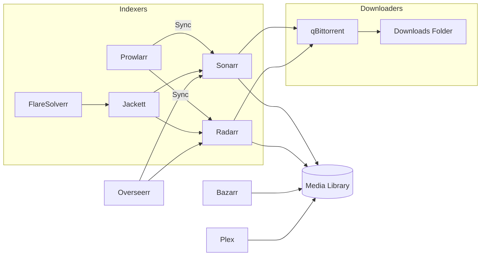

# ARR Stack — Docker Compose Setup

<p align="center">
  <a href="https://github.com/clickbang101/arr-stack">
    
  </a>
  <a href="https://github.com/clickbang101/arr-stack/blob/main/LICENSE">
    
  </a>
  
  
  <a href="https://github.com/clickbang101/arr-stack/stargazers">
    
  </a>
  <a href="https://github.com/clickbang101/arr-stack/issues">
    
  </a>
</p>

A complete media automation stack powered by Docker Compose — including **Plex, Sonarr, Radarr, qBittorrent, Prowlarr, Bazarr, Overseerr, Jackett, FlareSolverr, and LazyLibrarian**.

---

## 📚 Table of Contents
- [Architecture Diagram](#architecture-diagram)
- [Features](#-features)
- [Included Services](#-included-services)
- [Folder Structure](#-folder-structure)
- [Docker Compose File](#-docker-compose-file)
- [Default Ports](#-default-ports)
- [Deployment](#-deployment)
- [License](#-license)
- [Support](#-support)

---

## 🗺 Architecture Diagram





---

## 🚀 Features

- Fully containerized media ecosystem  
- Persistent storage mapping  
- Easy updates using LinuxServer.io images  
- Clean folder structure  
- Automatic downloading, sorting & metadata enrichment  

---

## 📦 Included Services

| Service        | Purpose                           |
|----------------|-----------------------------------|
| **Plex**       | Media server for movies & TV      |
| **qBittorrent**| Torrent client with Web UI        |
| **Sonarr**     | TV automation                     |
| **Radarr**     | Movie automation                  |
| **Prowlarr**   | Indexer manager                   |
| **Bazarr**     | Subtitle manager                  |
| **Overseerr**  | Request manager for Plex          |
| **Jackett**    | Extra indexer support             |
| **FlareSolverr** | Cloudflare bypass helper       |
| **LazyLibrarian** | Ebook & audiobook automation  |

---

## 📁 Folder Structure

```
/home/supervisor/
├── appdata/
│   ├── plex
│   ├── qbittorrent
│   ├── sonarr
│   ├── radarr
│   ├── prowlarr
│   ├── bazarr
│   ├── overseerr
│   ├── jackett
│   └── lazylibrarian
└── share/
    ├── media
    └── downloads
```

---

## 🧩 Docker Compose File

```yaml
version: "3.8"

services:
  plex:
    image: lscr.io/linuxserver/plex
    container_name: plex
    network_mode: host 
    environment:
      - PUID=1000
      - PGID=1000
      - VERSION=docker
      - TZ=Africa/Johannesburg
    volumes:
      - /home/supervisor/share/media:/media
      - /home/supervisor/appdata/plex:/config
    ports:
      - 32400:32400
    restart: unless-stopped

  qbittorrent:
    image: lscr.io/linuxserver/qbittorrent
    container_name: qbittorrent
    environment:
      - PUID=1000
      - PGID=1000
      - TZ=Africa/Johannesburg
      - WEBUI_PORT=8080
    volumes:
      - /home/supervisor/share/downloads:/downloads
      - /home/supervisor/appdata/qbittorrent:/config
    ports:
      - 8080:8080
      - 6881:6881
      - 6881:6881/udp
    restart: unless-stopped

  sonarr:
    image: linuxserver/sonarr
    container_name: sonarr
    environment:
      - PUID=1000
      - PGID=1000
      - TZ=Africa/Johannesburg
    volumes:
      - /home/supervisor/share/downloads:/downloads
      - /home/supervisor/share/media:/media
      - /home/supervisor/appdata/sonarr:/config
    ports:
      - 8989:8989
    restart: unless-stopped

  radarr:
    image: linuxserver/radarr
    container_name: radarr
    environment:
      - PUID=1000
      - PGID=1000
      - TZ=Africa/Johannesburg
    volumes:
      - /home/supervisor/share/downloads:/downloads
      - /home/supervisor/share/media:/media
      - /home/supervisor/appdata/radarr:/config
    ports:
      - 7878:7878
    restart: unless-stopped

  prowlarr:
    image: lscr.io/linuxserver/prowlarr
    container_name: prowlarr
    environment:
      - PUID=1000
      - PGID=1000
      - TZ=Africa/Johannesburg
    volumes:
      - /home/supervisor/appdata/prowlarr:/config
    ports:
      - 9696:9696
    restart: unless-stopped

  bazarr:
    image: linuxserver/bazarr
    container_name: bazarr
    environment:
      - PUID=1000
      - PGID=1000
      - TZ=Africa/Johannesburg
    volumes:
      - /home/supervisor/share/media:/media
      - /home/supervisor/appdata/bazarr:/config
    ports:
      - 6767:6767
    restart: unless-stopped

  overseerr:
    image: sctx/overseerr:latest
    container_name: overseerr
    environment:
      - LOG_LEVEL=info
      - TZ=Africa/Johannesburg
    ports:
      - 5055:5055
    volumes:
      - /home/supervisor/appdata/overseerr:/app/config
    restart: unless-stopped

  jackett:
    image: lscr.io/linuxserver/jackett
    container_name: jackett
    environment:
      - PUID=1000
      - PGID=1000
      - TZ=Africa/Johannesburg
    volumes:
      - /home/supervisor/appdata/jackett:/config
      - /home/supervisor/downloads:/downloads
    ports:
      - 9117:9117
    restart: unless-stopped

  flaresolverr:
    image: flaresolverr/flaresolverr:latest
    container_name: flaresolverr
    ports:
      - 8191:8191
    environment:
      - LOG_LEVEL=info
    platform: linux/amd64
    restart: unless-stopped

  lazylibrarian:
    image: linuxserver/lazylibrarian
    container_name: lazylibrarian
    environment:
      - PUID=1000
      - PGID=1000
      - TZ=Africa/Johannesburg
    volumes:
      - /home/supervisor/share/downloads:/downloads
      - /home/supervisor/share/media:/books
      - /home/supervisor/appdata/lazylibrarian:/config
    ports:
      - 5299:5299
    restart: unless-stopped

```

---

## 🌍 Default Ports

| App            | Port |
|----------------|------|
| Plex           | 32400 |
| qBittorrent    | 8080  |
| Sonarr         | 8989  |
| Radarr         | 7878  |
| Prowlarr       | 9696  |
| Bazarr         | 6767  |
| Overseerr      | 5055  |
| Jackett        | 9117  |
| FlareSolverr   | 8191  |
| LazyLibrarian  | 5299  |

---

## 🛠 Deployment

1. Install Docker + Docker Compose  
2. Clone the repository:

```bash
git clone https://github.com/clickbang101/arr-stack.git
cd arr-stack
```

3. Start the stack:

```bash
docker compose up -d
```

4. View logs:

```bash
docker compose logs -f
```

---

## 📝 License

This project is licensed under the **MIT License**.

---

## 🤝 Support

Feel free to open issues or suggestions to improve the stack!
